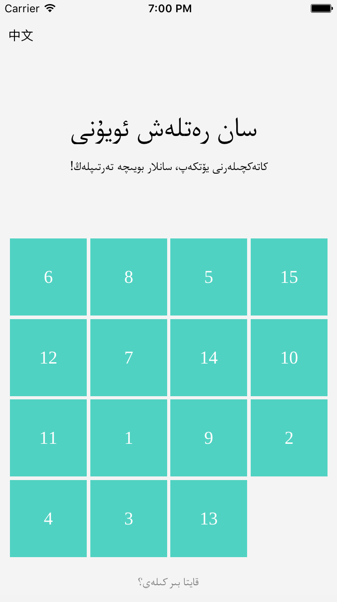
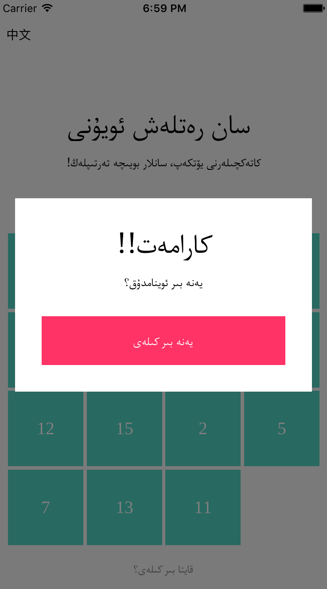
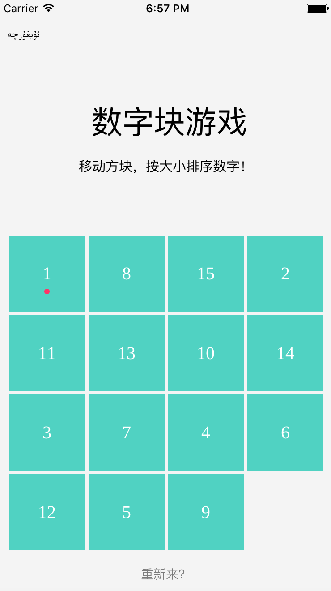
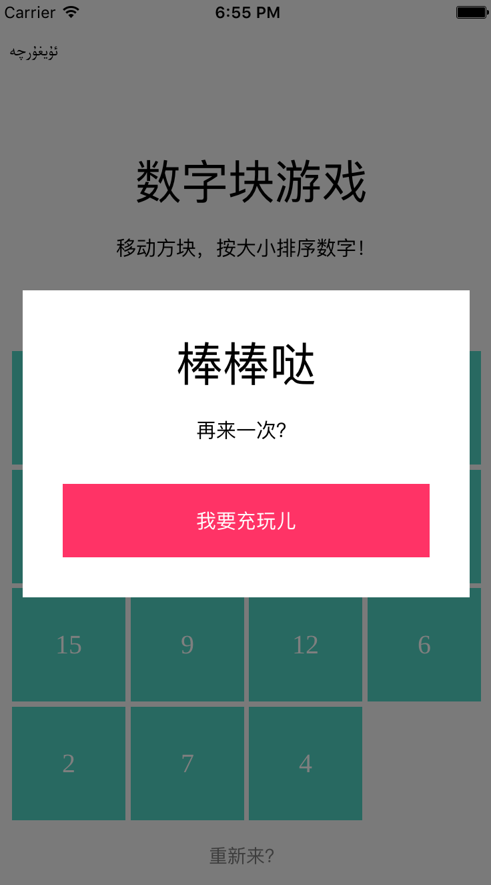
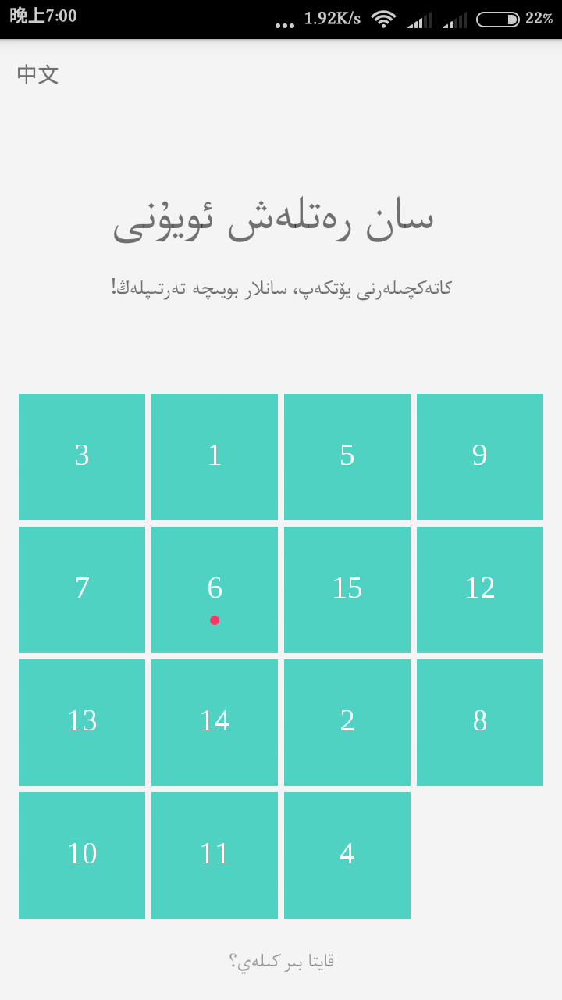
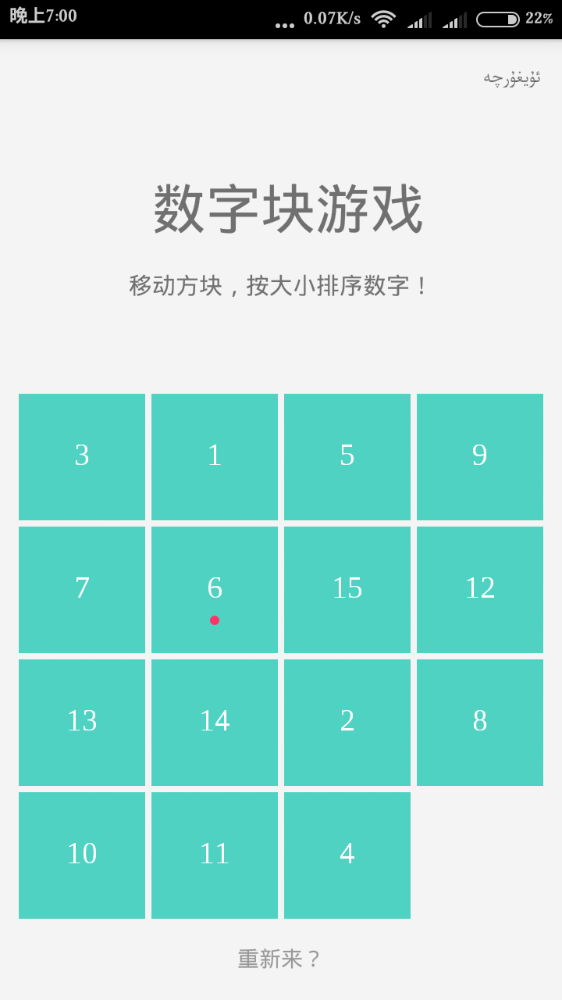

# "Dana" - data ordering game.

## About
  this is a simple React-Native game project. 
  
  *  you can brightly slide the tiles into order by numbers, it can be dotted if you put the tiles into right place;
  *  you can switch the interface btween Uyghur(维吾尔语) and Chinese(中文) language;  

  *  download for android (for ios you must run project yourself)

  [Download Dana](http://7fvd7y.com1.z0.glb.clouddn.com/app-release.apk?attname=&e=1469193621&token=3UHikWA-J5tC7aIEISTGX4vSZX20laF8GS-rFQhu:IenbkLpz_p0V6N-KpS8geEEvDvk)
  

## Screens 

### ios





### android
 



## Running

### Step One
clone the project from github

```
git clone https://github.com/teshna01/RN-Game-Dana.git
```
### Step Two
 cd into the project folder

```
npm install
```
### Step Three
run ios or android version(you can also run with Android Studio or xCode)

```
react-native run-android/run-ios
```
## Dependencies

  ```
  "dependencies": {
    "react": "^15.1.0",
    "react-native": "^0.27.2"
  }
  ```


